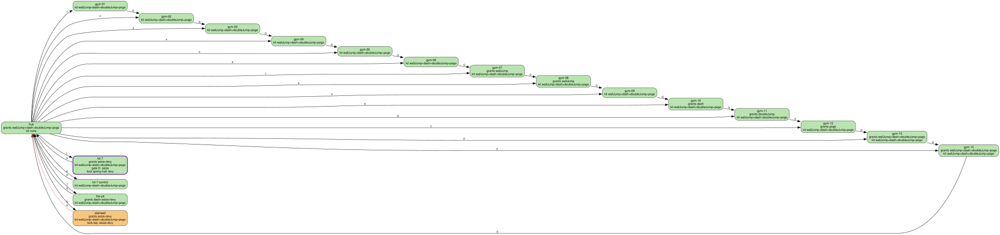

# Progression validator report

Generated 2026-09-28 13:25 by `npm run progression` (full mode) on build b2b0809a65, engine 14b64cfea8. 8 search workers, default budget 300000 nodes. Tool: `tools/progression/`; how to read it: `memory/progression.md`.

## Summary

| Check | World semantics (Phase 3: abilities persist) | Gym semantics (today: each room sets them) |
|---|---|---|
| Rooms reachable from the start | 25/25 | 25/25 |
| Exits (doors, G) reached | 48/48 | 48/48 |
| Softlocks (proven / suspected) | 0 / 0 | 0 / 0 |
| States explored | 41 | 25 |

- **Gate audit:** 6 annotated gates, 2 failing, 0 warning (full-kit bypass only).
- **Trap probes:** 311 ledges probed, 0 proven traps, 7 suspected.
- **Findings:** 2 errors (0 not in the baseline `tests/progression/baseline.json`), 10 warnings.
- **Run time:** extract 0.0 s, solve 0.9 s, audit 160.6 s, probes 168.0 s, design 0.0 s, total 329.4 s.

Green: reached (world semantics). Red: not reached. Orange: a softlock or trap in the room. Purple border: a failing gate. Dashed edge: exit never reached.

## Findings

| Level | Baseline | Finding |
|---|---|---|
| error | accepted | gate lot-7/lock:spring-hall: G7 minus levy {wallJump, dash, doubleJump, pogo, seize} bypasses it; minimal: {wallJump, seize} or {doubleJump, seize} |
| error | accepted | gate yard/lock:bar-wall: room kit {dash, seize, levy} without the seize:up aim bypasses it |
| warning |  | suspected trap in stairwell: ledge x10-19,y18 is reachable from default with {wallJump, dash, doubleJump, pogo, seize, levy} but nothing gets back out |
| warning |  | suspected trap in stairwell: ledge x10-19,y25 is reachable from default with {wallJump, dash, doubleJump, pogo, seize, levy} but nothing gets back out |
| warning |  | suspected trap in stairwell: ledge x10-19,y18 is reachable from default with {seize, levy} but nothing gets back out |
| warning |  | suspected trap in stairwell: ledge x10-19,y25 is reachable from default with {seize, levy} but nothing gets back out |
| warning |  | suspected trap in yard: ledge x28-33,y15 is reachable from default with {dash, seize, levy} but nothing gets back out |
| warning |  | suspected trap in yard: ledge x7-27,y21 is reachable from default with {dash, seize, levy} but nothing gets back out |
| warning |  | suspected trap in the-pit: ledge x19-23,y9 is reachable from default with {dash, seize, levy} but nothing gets back out |
| warning |  | design docs/design/world-design.md: G2/G7 proof: e13: gap 10 tiles < kit-without-slip {levy, seize, flag:shortcut:storeLatch} + palette {brown, violet} = 12.1 + 1 margin (§3.1 table) |
| warning |  | design docs/design/world-design.md: G7 proof: e13: proof says kit-without-key reaches 7.6 tiles; the §3.1 table gives 12.1 for {levy, seize, flag:shortcut:storeLatch} + B5's palette {brown, violet} (if the gated span is sound-free or in B6, say so with gate.approachPalette) |
| warning |  | design docs/design/world-design.md: G2/G7 proof: e33: gap 28 tiles < kit-without-hueAndCry {levy, ropeSkip, seize, slip, flag:boss:auctioneer, flag:boss:grindstone, flag:shortcut:dumbwaiter, flag:shortcut:storeLatch, fever 1} + palette {violet, brown, pink} = 48.7 + 1 margin (§3.1 table) |

## Gate audit

Each key ability K of a gate must be necessary. **G7** (governs): the target must be unreachable with every kit the player can still have in that room when K is removed from the game (the bag empties on room exit, so the kit is abilities plus the room's own palette, which the bot sim contains). **Full kit**: every sim ability except K (future-proofing). **G3/G8**: a reach gate may not share a room with pink unless pink is the key, and then it must be a teachGate. **Aims** (`moves`, e.g. `seize:up`): with the room's own kit and that aimed move forbidden (the bot prunes any state where it started), the target must stay unreachable.

### lot-7/gate:D: **PASS**

- Tile gate D (opens on plate), sealed; requires {seize}; target `rect:2560,448,128,320` from spawn default (far side of gate D: tiles x 40-41, y 7-11).
- Room palette: {brown, pink}.

| Key removed | Basis | Kit | Result | Minimal bypass combos (evidence) |
|---|---|---|---|---|
| seize | G7 | {wallJump, dash, doubleJump, pogo, levy} | holds: unreachable (static proof) |  |

### lot-7/lock:spring-hall: **FAIL**

- Lock "spring-hall", reach, teachGate; requires {levy}; target `rect:1536,512,64,256` from spawn default.
- Room palette: {brown, pink}. Note: The 6-tile hall is climbed on a pink levy spring (L3 brief §4.2); the upper corridor must need Levy (L3 audit item 3).

| Key removed | Basis | Kit | Result | Minimal bypass combos (evidence) |
|---|---|---|---|---|
| levy | G7 | {wallJump, dash, doubleJump, pogo, seize} | **BYPASSED** (118 f) | {wallJump, seize} 166 f [tape](progression-evidence/lot-7.lock.spring-hall.wallJump+seize.json); {doubleJump, seize} 156 f [tape](progression-evidence/lot-7.lock.spring-hall.doubleJump+seize.json) (22 combos tried) |

Bypass tapes (input DSL)

- {wallJump, seize}: `R+J8 R4 R+J4 R12 R+J8 R4 R+J4 R+S4 .4 R8 R+J20 R4 .4 R+J20 R8 R+J4 J4 R+J20 R4 J4 R+J4 R10`
- {doubleJump, seize}: `R+J8 R12 R+J12 .4 R4 R+J4 R+J+S4 J8 R+J8 R4 R+J12 R8 R+J4 R4 R+J4 R4 R+J4 R8 R+J4 J4 R+J4 J4 R4 J4 R+J4 J4 R+J4 R4`

### stairwell/lock:top: **PASS**

- Lock "top", reach, teachGate; requires {seize, levy}; target `G` from spawn default.
- Room palette: {pink}. Note: Expression room: the climb is the up-seize / down-levy spring chain.

| Key removed | Basis | Kit | Result | Minimal bypass combos (evidence) |
|---|---|---|---|---|
| seize | G7 | {wallJump, dash, doubleJump, pogo, levy} | holds: unreachable (static proof) |  |
| levy | G7 | {wallJump, dash, doubleJump, pogo, seize} | holds: not found in 300000 nodes |  |

### yard/gate:D: **PASS**

- Tile gate D (opens on plate), sealed; requires {seize}; target `rect:960,1152,64,256` from spawn default (far side of gate D: tiles x 15-15, y 18-21).
- Room palette: {brown, pink}.

| Key removed | Basis | Kit | Result | Minimal bypass combos (evidence) |
|---|---|---|---|---|
| seize | G7 | {wallJump, dash, doubleJump, pogo, levy} | holds: unreachable (static proof) |  |

### yard/lock:bar-wall: **FAIL**

- Lock "bar-wall", reach, teachGate; requires {seize, levy}; target `rect:1792,960,384,64` from spawn default after the prelude `R15 R+S1 .14 R18 R+V1 .40`.
- Room palette: {brown, pink}. Note: Section B: the top of the 6-tile plateau should need the Up+Seize of bar 1 (then a Levy spring at the wall); a forward seize or a brown crate + jump must not do. The prelude solves section A (furnace slab on the plate, gate open) so the bot starts where B is taught.

| Key removed | Basis | Kit | Result | Minimal bypass combos (evidence) |
|---|---|---|---|---|
| seize | G7 | {wallJump, dash, doubleJump, pogo, levy} | holds: unreachable (static proof) |  |
| levy | G7 | {wallJump, dash, doubleJump, pogo, seize} | holds: not found in 300000 nodes |  |
| seize:up | room kit, aim forbidden | {dash, seize, levy} | **BYPASSED** (275 f) | {dash, seize, levy} 275 f [tape](progression-evidence/yard.lock.bar-wall.dash+seize+levy.no-seize-up.json) |

Bypass tapes (input DSL)

- {dash, seize, levy}: `R16 R+J16 R24 R+J14 R+J+S1 R+J6 .20 R20 R+V1 .30 R60`

### yard/lock:ledge: **PASS**

- Lock "ledge", reach, teachGate; requires {seize, levy}; target `G` from spawn default after the prelude `R15 R+S1 .14 R18 R+V1 .40 R16 R+J16 R50 J6 U+J+S1 J10 .20 R30 R+V1 .30 R60`.
- Room palette: {brown, pink}. Note: Section C: the G ledge 8 tiles above the pit should need a mid-air Down+Levy spring (a forward throw lands in the pit).

| Key removed | Basis | Kit | Result | Minimal bypass combos (evidence) |
|---|---|---|---|---|
| seize | G7 | {wallJump, dash, doubleJump, pogo, levy} | holds: unreachable (static proof) |  |
| levy | G7 | {wallJump, dash, doubleJump, pogo, seize} | holds: not found in 300000 nodes |  |
| levy:down | room kit, aim forbidden | {dash, seize, levy} | holds: not found in 300000 nodes; with the aim: reached (tape) |  |

## Reachability: world semantics

Abilities persist and only grow. A room's declared `abilities` are an implicit pickup (`grant:<room>`) collected on entry; explicit `pickups` where they stand. Kit = abilities held when taking the exit into the room.

| Room | Reached | Kit on arrival (minimal) | Exits (evidence) |
|---|---|---|---|
| hub | ✓ | {none} | exit:1→gym-01 ✓ (bot) exit:2→gym-02 ✓ (bot) exit:3→gym-03 ✓ (bot) exit:4→gym-04 ✓ (bot) exit:5→gym-05 ✓ (bot) exit:6→gym-06 ✓ (bot) exit:7→gym-07 ✓ (bot) exit:8→gym-08 ✓ (bot) exit:9→gym-09 ✓ (bot) exit:A→gym-10 ✓ (bot) exit:B→gym-11 ✓ (bot) exit:C→gym-12 ✓ (bot) exit:D→gym-13 ✓ (bot) exit:E→gym-14 ✓ (bot) exit:L→lot-7 ✓ (bot) exit:K→lot-7-control ✓ (bot) exit:S→stairwell ✓ (bot) exit:Y→yard ✓ (bot) exit:T→the-pit ✓ (bot) exit:W→ring-barker ✓ (bot) exit:X→ring-gull ✓ (bot) exit:Z→ring-grinder ✓ (bot) exit:Q→ring-clerk ✓ (bot) exit:U→auction ✓ (bot) |
| gym-01 | ✓ | {wallJump, dash, doubleJump, pogo} | G→gym-02 ✓ (tape: tests/replays/gym-01.none.json) |
| gym-02 | ✓ | {wallJump, dash, doubleJump, pogo} | G→gym-03 ✓ (tape: tests/replays/gym-02.none.json) |
| gym-03 | ✓ | {wallJump, dash, doubleJump, pogo} | G→gym-04 ✓ (tape: tests/replays/gym-03.none.json) |
| gym-04 | ✓ | {wallJump, dash, doubleJump, pogo} | G→gym-05 ✓ (tape: tests/replays/gym-04.none.json) |
| gym-05 | ✓ | {wallJump, dash, doubleJump, pogo} | G→gym-06 ✓ (tape: tests/replays/gym-05.none.json) |
| gym-06 | ✓ | {wallJump, dash, doubleJump, pogo} | G→gym-07 ✓ (tape: tests/replays/gym-06.none.json) |
| gym-07 | ✓ | {wallJump, dash, doubleJump, pogo} | G→gym-08 ✓ (tape: tests/replays/gym-07.wallJump.json) |
| gym-08 | ✓ | {wallJump, dash, doubleJump, pogo} | G→gym-09 ✓ (tape: tests/replays/gym-08.wallJump.json) |
| gym-09 | ✓ | {wallJump, dash, doubleJump, pogo} | G→gym-10 ✓ (tape: tests/replays/gym-09.none.json) |
| gym-10 | ✓ | {wallJump, dash, doubleJump, pogo} | G→gym-11 ✓ (tape: tests/replays/gym-10.dash.json) |
| gym-11 | ✓ | {wallJump, dash, doubleJump, pogo} | G→gym-12 ✓ (tape: tests/replays/gym-11.doubleJump.json) |
| gym-12 | ✓ | {wallJump, dash, doubleJump, pogo} | G→gym-13 ✓ (tape: tests/replays/gym-12.pogo.json) |
| gym-13 | ✓ | {wallJump, dash, doubleJump, pogo} | G→gym-14 ✓ (tape: tests/replays/gym-13.all.json) |
| gym-14 | ✓ | {wallJump, dash, doubleJump, pogo} | G→hub ✓ (tape: tests/replays/gym-14.all.json) |
| lot-7 | ✓ | {wallJump, dash, doubleJump, pogo} | G→hub ✓ (tape: tests/replays/lot-7.heavy.json) |
| lot-7-control | ✓ | {wallJump, dash, doubleJump, pogo} | G→hub ✓ (tape: tests/replays/lot-7-control.json) |
| the-pit | ✓ | {wallJump, dash, doubleJump, pogo} | G→hub ✓ (tape: tests/replays/the-pit.jabOnly.s1.json) |
| stairwell | ✓ | {wallJump, dash, doubleJump, pogo} | G→hub ✓ (tape: tests/replays/stairwell.chain.json) |
| yard | ✓ | {wallJump, dash, doubleJump, pogo} | G→hub ✓ (tape: tests/replays/yard.aims.json) |
| ring-barker | ✓ | {wallJump, dash, doubleJump, pogo} | G→hub ✓ (tape: tests/replays/ring-barker.signature.s1.json) |
| ring-gull | ✓ | {wallJump, dash, doubleJump, pogo} | G→hub ✓ (tape: tests/replays/ring-gull.signature.s1.json) |
| ring-grinder | ✓ | {wallJump, dash, doubleJump, pogo} | G→hub ✓ (tape: tests/replays/ring-grinder.signature.s1.json) |
| ring-clerk | ✓ | {wallJump, dash, doubleJump, pogo} | G→hub ✓ (tape: tests/replays/ring-clerk.signature.s1.json) |
| auction | ✓ | {wallJump, dash, doubleJump, pogo} | G→hub ✓ (tape: tests/replays/auction.signature.s1.json) |

## Reachability: gym semantics

What the sim does today: entering a room sets the abilities to the room's declared set.

| Room | Reached | Kit on arrival (minimal) | Exits (evidence) |
|---|---|---|---|
| hub | ✓ | {none} | exit:1→gym-01 ✓ (cache) exit:2→gym-02 ✓ (cache) exit:3→gym-03 ✓ (cache) exit:4→gym-04 ✓ (cache) exit:5→gym-05 ✓ (cache) exit:6→gym-06 ✓ (cache) exit:7→gym-07 ✓ (cache) exit:8→gym-08 ✓ (cache) exit:9→gym-09 ✓ (cache) exit:A→gym-10 ✓ (cache) exit:B→gym-11 ✓ (cache) exit:C→gym-12 ✓ (cache) exit:D→gym-13 ✓ (cache) exit:E→gym-14 ✓ (cache) exit:L→lot-7 ✓ (cache) exit:K→lot-7-control ✓ (cache) exit:S→stairwell ✓ (cache) exit:Y→yard ✓ (cache) exit:T→the-pit ✓ (cache) exit:W→ring-barker ✓ (cache) exit:X→ring-gull ✓ (cache) exit:Z→ring-grinder ✓ (cache) exit:Q→ring-clerk ✓ (cache) exit:U→auction ✓ (cache) |
| gym-01 | ✓ | {wallJump, dash, doubleJump, pogo} | G→gym-02 ✓ (tape: tests/replays/gym-01.none.json) |
| gym-02 | ✓ | {none} | G→gym-03 ✓ (tape: tests/replays/gym-02.none.json) |
| gym-03 | ✓ | {none} | G→gym-04 ✓ (tape: tests/replays/gym-03.none.json) |
| gym-04 | ✓ | {none} | G→gym-05 ✓ (tape: tests/replays/gym-04.none.json) |
| gym-05 | ✓ | {none} | G→gym-06 ✓ (tape: tests/replays/gym-05.none.json) |
| gym-06 | ✓ | {none} | G→gym-07 ✓ (tape: tests/replays/gym-06.none.json) |
| gym-07 | ✓ | {none} | G→gym-08 ✓ (tape: tests/replays/gym-07.wallJump.json) |
| gym-08 | ✓ | {wallJump} | G→gym-09 ✓ (tape: tests/replays/gym-08.wallJump.json) |
| gym-09 | ✓ | {wallJump} | G→gym-10 ✓ (tape: tests/replays/gym-09.none.json) |
| gym-10 | ✓ | {none} | G→gym-11 ✓ (tape: tests/replays/gym-10.dash.json) |
| gym-11 | ✓ | {dash} | G→gym-12 ✓ (tape: tests/replays/gym-11.doubleJump.json) |
| gym-12 | ✓ | {doubleJump} | G→gym-13 ✓ (tape: tests/replays/gym-12.pogo.json) |
| gym-13 | ✓ | {pogo} | G→gym-14 ✓ (tape: tests/replays/gym-13.all.json) |
| gym-14 | ✓ | {wallJump, dash, doubleJump, pogo} | G→hub ✓ (tape: tests/replays/gym-14.all.json) |
| lot-7 | ✓ | {wallJump, dash, doubleJump, pogo} | G→hub ✓ (tape: tests/replays/lot-7.heavy.json) |
| lot-7-control | ✓ | {wallJump, dash, doubleJump, pogo} | G→hub ✓ (tape: tests/replays/lot-7-control.json) |
| the-pit | ✓ | {wallJump, dash, doubleJump, pogo} | G→hub ✓ (tape: tests/replays/the-pit.jabOnly.s1.json) |
| stairwell | ✓ | {wallJump, dash, doubleJump, pogo} | G→hub ✓ (tape: tests/replays/stairwell.chain.json) |
| yard | ✓ | {wallJump, dash, doubleJump, pogo} | G→hub ✓ (tape: tests/replays/yard.aims.json) |
| ring-barker | ✓ | {wallJump, dash, doubleJump, pogo} | G→hub ✓ (tape: tests/replays/ring-barker.signature.s1.json) |
| ring-gull | ✓ | {wallJump, dash, doubleJump, pogo} | G→hub ✓ (tape: tests/replays/ring-gull.signature.s1.json) |
| ring-grinder | ✓ | {wallJump, dash, doubleJump, pogo} | G→hub ✓ (tape: tests/replays/ring-grinder.signature.s1.json) |
| ring-clerk | ✓ | {wallJump, dash, doubleJump, pogo} | G→hub ✓ (tape: tests/replays/ring-clerk.signature.s1.json) |
| auction | ✓ | {wallJump, dash, doubleJump, pogo} | G→hub ✓ (tape: tests/replays/auction.signature.s1.json) |

## In-room trap probes

311 (room, entry, kit, ledge) probes: 300 ledges get back to their entry or an exit, 4 stuck ledges are not reachable anyway, 7 traps. 168.0 s.

- Suspected trap: stairwell ledge x10-19,y18 (entry default, kit {wallJump, dash, doubleJump, pogo, seize, levy}); reach tape `.5 J12 U+J+S1 J8 .4 D+V1 .28 D+S1 .36 D+V1 .10 U+S1 .24 D+V1 .9 U+S1 .22 R36 .10 D+V1 .4 R26`
- Suspected trap: stairwell ledge x10-19,y25 (entry default, kit {wallJump, dash, doubleJump, pogo, seize, levy}); reach tape `.5 J12 U+J+S1 J8 .4 D+V1 .28 D+S1 .36 D+V1 .10 U+S1 .24 D+V1 .9 U+S1 .22 R36 .10 D+V1 .4 R26`
- Suspected trap: stairwell ledge x10-19,y18 (entry default, kit {seize, levy}); reach tape `.5 J12 U+J+S1 J8 .4 D+V1 .28 D+S1 .36 D+V1 .10 U+S1 .24 D+V1 .9 U+S1 .22 R36 .10 D+V1 .4 R26`
- Suspected trap: stairwell ledge x10-19,y25 (entry default, kit {seize, levy}); reach tape `.5 J12 U+J+S1 J8 .4 D+V1 .28 D+S1 .36 D+V1 .10 U+S1 .24 D+V1 .9 U+S1 .22 R36 .10 D+V1 .4 R26`
- Suspected trap: yard ledge x28-33,y15 (entry default, kit {dash, seize, levy}); reach tape `R15 R+S1 .14 R18 R+V1 .40 R16 R+J16 R24 R+J14 R+J+S1 R+J6 .20 R20 R+V1 .30 R60`
- Suspected trap: yard ledge x7-27,y21 (entry default, kit {dash, seize, levy}); reach tape `R15 R+S1 .14 R18 R+V1 .40 R16 R+J16 R24 R+J14 R+J+S1 R+J6 .20 R20 R+V1 .30 R60`
- Suspected trap: the-pit ledge x19-23,y9 (entry default, kit {dash, seize, levy}); reach tape `D+J1 L20 L+A1 L2 L+A1 L1 L+A1 L1 L+A1 L1 L+A1 L1 L+A1 L1 L+A1 L8 .11 L8 .1 L+A1 .2 L+A1 L1 L+A1 L1 L+A1 R1 L+A1 L1 L+A1 .1 L+A1 .19 R78 L54 R4 .2 R1 .1 R1 .7 R+A1 .1 R1 R+A1 R1 R+A1 R1 R+A1 R1 R+A1 R1 R+A1 L1 L+A1 L1 .7 R4 .10 R+A1 .2 R+A1 R1 R+A1 R1 R+A1 R1 R+A1 R1 R+A1 R1 R+A1 .28 R+A1 .2 R+A1 R1 R+A1 R1 R+A1 R1 R+A1 R1 R+A1 .1 R+A1 J18 .12 D+A1 .40 R+A1 .2 R+A1 R1 R+A1 R1 R+A1 R1 R+A1 R1 R+A1 .1 R+A1 .28 R+A1 .2 R+A1 R1 R+A1 R1 R+A1 R1 R+A1 R1 .21 R+A1 .2 R+A1 R1 L+A1 L1 L+A1 R1 R+A1 R1 .21 L+A1 .2 R+A1 L1 L+A1 R1 R+A1 R1 L+A1 L1 .21 L+A1 .2 L+A1 R1 R+A1 L1 L+A1 L1 R+A1 R1 .21 R+A1 R2 R+A1 R1 R+A1 R1 R+A1 R1 R+A1 R70 R+J12 L+J2 .1 L+J4 U+A1 L+J7 R+J8 L+J7 L1 L+J4 R+J8 L+J2 .1 L+J3 .2 L+J1 .3 L+J1 .1 L+J1 R+J3 L+J4 .5 R+J12 L+J2 .1 L+J3 U+A1 L+J3 R+J14 L+J6 L1 L+J9 R+J5 .1 R+J3 L+J3 U+A1 L+J3 R+J12 R1 L+J9 R+J5 .1 R+J3 U+A1 R+J4 L+J9 R+J10 R1 L+J11 R+J3 .1 R+J5 L+J1 U+A1 L+J7 R+J8 R1 R+J2 L+J12 .1 R+J10 L+J12 L1 R+J9 L+J5 .1 L+J5 U+A1 L+J1 R+J4 .1 R+J19 R20 .1 R+J19 R20 .1 R+J19 R20 .1 R+J19 R20 .1 R+J19 R20 .1 R+J19 R20 .1 R+J19 R20 .1 R+J19 R20 .1 R+J19 R20 .1 R+J19 R20 .1 R+J19 R20 .1 R+J19 R20 .1 R+J19 R20 .1 R+J19 R20 .1 R+J19 R20`

## World graph (extracted from room data)

| Room | Grant | Entries | Exits | Pickups / Rests | Gates | Palette | Hazards |
|---|---|---|---|---|---|---|---|
| hub | {wallJump, dash, doubleJump, pogo} | default | exit:1→gym-01, exit:2→gym-02, exit:3→gym-03, exit:4→gym-04, exit:5→gym-05, exit:6→gym-06, exit:7→gym-07, exit:8→gym-08, exit:9→gym-09, exit:A→gym-10, exit:B→gym-11, exit:C→gym-12, exit:D→gym-13, exit:E→gym-14, exit:L→lot-7, exit:K→lot-7-control, exit:S→stairwell, exit:Y→yard, exit:T→the-pit, exit:W→ring-barker, exit:X→ring-gull, exit:Z→ring-grinder, exit:Q→ring-clerk, exit:U→auction | hub/rest:corner | - | {none} | - |
| gym-01 | {none} | default | G→gym-02 | - | - | {none} | - |
| gym-02 | {none} | default | G→gym-03 | - | - | {none} | - |
| gym-03 | {none} | default | G→gym-04 | - | - | {none} | 45 spikes |
| gym-04 | {none} | default | G→gym-05 | - | - | {none} | 24 spikes |
| gym-05 | {none} | default | G→gym-06 | - | - | {none} | - |
| gym-06 | {none} | default | G→gym-07 | - | - | {none} | - |
| gym-07 | {wallJump} | default | G→gym-08 | - | - | {none} | - |
| gym-08 | {wallJump} | default | G→gym-09 | - | - | {none} | 10 spikes |
| gym-09 | {none} | default | G→gym-10 | - | - | {none} | 8 spikes |
| gym-10 | {dash} | default | G→gym-11 | - | - | {none} | 15 spikes |
| gym-11 | {doubleJump} | default | G→gym-12 | - | - | {none} | 10 spikes |
| gym-12 | {pogo} | default | G→gym-13 | - | - | {none} | 28 spikes, 5 orbs |
| gym-13 | {wallJump, dash, doubleJump, pogo} | default | G→gym-14 | - | - | {none} | 23 spikes, 2 orbs |
| gym-14 | {wallJump, dash, doubleJump, pogo} | default | G→hub | - | - | {none} | 12 spikes |
| lot-7 | {seize, levy} | default | G→hub | - | gate:D {seize} sealed, lock:spring-hall {levy} reach | {brown, pink} | - |
| lot-7-control | {none} | default | G→hub | - | - | {none} | - |
| the-pit | {dash, seize, levy} | default | G→hub | - | - | {brown, pink, violet} | barker barker grinder |
| stairwell | {seize, levy} | default | G→hub | - | lock:top {seize, levy} reach | {pink} | - |
| yard | {dash, seize, levy} | default | G→hub | - | gate:D {seize} sealed, lock:bar-wall {seize, levy} reach, lock:ledge {seize, levy} reach | {brown, pink} | - |
| ring-barker | {dash, seize, levy} | default | G→hub | - | - | {pink} | barker |
| ring-gull | {dash, seize, levy} | default | G→hub | - | - | {violet} | gull |
| ring-grinder | {dash, seize, levy} | default | G→hub | - | - | {brown, violet} | grinder |
| ring-clerk | {dash, seize, levy} | default | G→hub | - | - | {brown} | clerk |
| auction | {dash, seize, levy} | default | G→hub | - | - | {brown, pink, violet} | 28 spikes, auctioneer |

## Design graph: tests/progression/gym-world.json

25 rooms, 48 edges. Symbolic solve (abilities × flags × fever): 25 non-stub rooms reachable, 0 not. 4 ms.

Every design check passes.

**G7 plan** (kits each reach gate must fail against once built; the room palette is part of the kit):

| Edge | Key | Kits without the key (+ room palette) | Sim kits |
|---|---|---|---|
| stairwell-G stairwell→hub (teach) | seize | {dash, doubleJump, levy, pogo, wallJump} + {pink} | {wallJump, dash, doubleJump, pogo, levy} |
| stairwell-G stairwell→hub (teach) | levy | {dash, doubleJump, pogo, seize, wallJump} + {pink} | {wallJump, dash, doubleJump, pogo, seize} |
| yard-G yard→hub (teach) | seize | {dash, doubleJump, levy, pogo, wallJump} + {brown, pink} | {wallJump, dash, doubleJump, pogo, levy} |
| yard-G yard→hub (teach) | levy | {dash, doubleJump, pogo, seize, wallJump} + {brown, pink} | {wallJump, dash, doubleJump, pogo, seize} |

**Diff against the built rooms:**

Design and build agree.

## Design graph: docs/design/world-design.md

28 rooms, 38 edges. Symbolic solve (abilities × flags × fever): 21 non-stub rooms reachable, 2 not. 17 ms.

| Level | Check | Subject | Detail |
|---|---|---|---|
| error | G2/G7 proof | e13 | gap 10 tiles < kit-without-slip {levy, seize, flag:shortcut:storeLatch} + palette {brown, violet} = 12.1 + 1 margin (§3.1 table) |
| warning | G7 proof | e13 | proof says kit-without-key reaches 7.6 tiles; the §3.1 table gives 12.1 for {levy, seize, flag:shortcut:storeLatch} + B5's palette {brown, violet} (if the gated span is sound-free or in B6, say so with gate.approachPalette) |
| error | G2/G7 proof | e33 | gap 28 tiles < kit-without-hueAndCry {levy, ropeSkip, seize, slip, flag:boss:auctioneer, flag:boss:grindstone, flag:shortcut:dumbwaiter, flag:shortcut:storeLatch, fever 1} + palette {violet, brown, pink} = 48.7 + 1 margin (§3.1 table) |

**Sanctioned breaks:**

- e17: adds: B11 with {levy, seize, slip}; B12 with {levy, seize, slip}; B12c with {levy, seize, slip}; B13 with {levy, seize, slip, flag:boss:auctioneer, fever 1}; X2 with {levy, seize, slip, flag:boss:auctioneer, fever 1}; EX_ROW_ROOFS with {levy, seize, slip, flag:boss:auctioneer, fever 1}; EX_FOUNDRY with {levy, seize, slip, flag:boss:auctioneer, fever 1}

**G7 plan** (kits each reach gate must fail against once built; the room palette is part of the kit):

| Edge | Key | Kits without the key (+ room palette) | Sim kits |
|---|---|---|---|
| e04 B1→B2 (teach) | levy | {seize} + {pink, white} | {pogo, seize} |
| e08 B2→X5 | ropes | {levy, ropeSkip, seize, slip, flag:boss:auctioneer, flag:boss:grindstone, flag:shortcut:dumbwaiter, flag:shortcut:storeLatch, fever 1} + {brown, brown, violet} | {dash, doubleJump, pogo, seize, levy} |
| e13 B5→B6 | slip | {levy, seize, flag:shortcut:storeLatch} + {brown, violet} | {pogo, seize, levy} |
| e14 B6→B8 (teach) | local:violet | {levy, seize, slip} + {none} | {dash, pogo, seize, levy} |
| e18 B8→B9 | local:brown | {levy, ropeSkip, seize, slip, flag:boss:auctioneer, flag:boss:grindstone, flag:shortcut:dumbwaiter, flag:shortcut:storeLatch, fever 1} + {none} | {dash, doubleJump, pogo, seize, levy} |
| e23 B11→B12 | ropeSkip | {levy, seize, slip, flag:boss:auctioneer, flag:boss:grindstone, flag:shortcut:dumbwaiter, flag:shortcut:storeLatch, fever 1} + {none} | {dash, pogo, seize, levy} |
| e29 T1→EX_ROW | ropeSkip | {levy, seize, slip, flag:boss:auctioneer, flag:boss:grindstone, flag:shortcut:dumbwaiter, flag:shortcut:storeLatch, fever 1} + {brown} | {dash, pogo, seize, levy} |
| e30 T2→EX_ROW_ROOFS | local:pink | {levy, ropeSkip, seize, slip, flag:boss:auctioneer, flag:boss:grindstone, flag:shortcut:dumbwaiter, flag:shortcut:storeLatch, fever 1} + {brown} | {dash, doubleJump, pogo, seize, levy} |
| e33 B13→EX_RECEIVERSHIP | hueAndCry | {levy, ropeSkip, seize, slip, flag:boss:auctioneer, flag:boss:grindstone, flag:shortcut:dumbwaiter, flag:shortcut:storeLatch, fever 1} + {violet, brown, pink} | key not in the sim yet |

Notes

- every non-stub room reachable from start: X3: behind ability:writ, which nothing in this graph grants (a later return)
- every non-stub room reachable from start: X5: behind ability:ropes, which nothing in this graph grants (a later return)
- G7: e19: reach edge keyed by flag/fever/weight only: the bot proof needs the built room

**Diff against the built rooms:**

| Level | Kind | Subject | Detail |
|---|---|---|---|
| info | not-built | 22 rooms | T1, T2, T3, B1, B2, B3, B4, B5, B6, B7, B8, B9, B10, B11, B12, B13, X1, X2, X3, X4, X5, X6 |
| info | not-designed | 25 rooms | built but not in the design: hub, gym-01, gym-02, gym-03, gym-04, gym-05, gym-06, gym-07, gym-08, gym-09, gym-10, gym-11, gym-12, gym-13, gym-14, lot-7, lot-7-control, the-pit, stairwell, yard, ring-barker, ring-gull, ring-grinder, ring-clerk, auction |

## Oracle and timings

Queries 661: static proofs 27, cache hits 101, inferred by monotonicity 30, committed tapes 102, bot searches 401 (329.2 s wall), tapes re-verified 0, stale records trusted 0.

